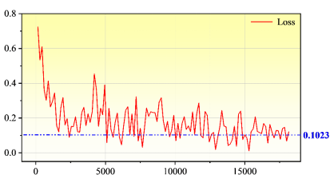
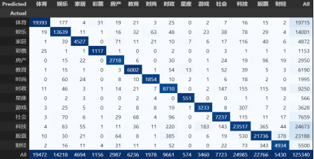
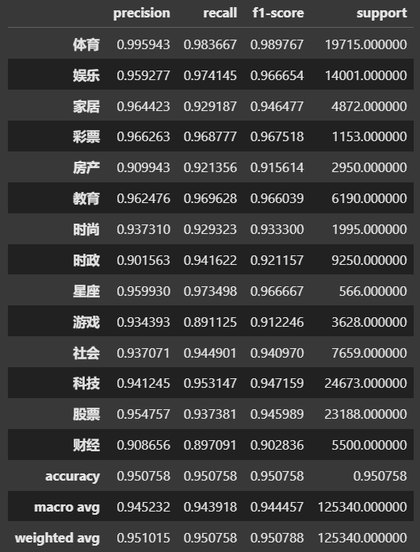
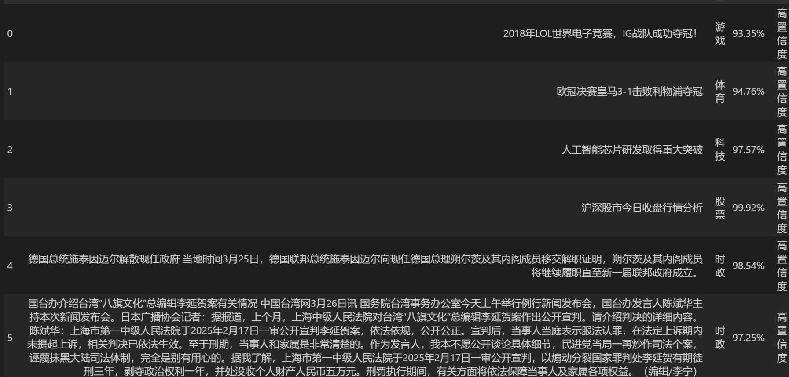

**项目说明**：

本次实验主要基于***\*THUCNews\****中文文本分类数据集，包含83万新闻数据，采用了***\*wobert\****以词为单位的中文BERT模型进行文本分类任务。

**数据类型**：

```
半全场08084期开奖：一等奖无人中 23万滚存下期   [标题]
　　中国足球彩票半全场第08084期开奖揭晓：一等奖无人中，233784.32元滚存。本期半全场全国总销量：365288元。   [正文]
```

**项目文件夹格式**：

```bash
text-classifier/
├── config.json          # 主配置
├── main.ipynb           # 主文件
├── data/
    └── label2id.json    # 标签映射
├── model/
    └── bert-base-chinese/  # 官方BERT模型
        ├── config.json
        ├── pytorch_model.bin
        ├── tokenizer_config.json
        └── vocab.txt
    |—— best_model.pth   # 最佳的模型文件
└── saved_models/        # 训练好的分类模型
    ├── config.json      # 微调后的模型配置
    ├── model.safetensors
    ├── special_tokens_map.json
    ├── tokenizer_config.json
    └── pytorch_model.bin
```

**步骤说明**：

```
1.在项目目录，下载数据集，放置到data文件夹下（自行创建data文件夹）（下载地址：[http://thuctc.thunlp.org/](http://thuctc.thunlp.org/)）
2.运行prepare_dataset.py（注意修改确认文件路径配置），在data文件下生成训练数据train.csv test.csv valid.csv 以及标签到id的映射文件label2id.json
3.开始训练！
运行main.ipynb（main文件中存在三个cell代码块部分[训练+预测+评估]）
注意config.json中包含了main文件代码中参数配置，如有需要可以修改。
此处建议在训练之前优先创建一个saved_models文件夹，用于保存生成的模型文件的配置文件
model文件下包含文件夹bert_base-chinese，其中为BERT预训练模型，可以去HuggingFace下载，下载地址：https://huggingface.co/bert-base-chinese#
ps：强烈建议使用GPU运行训练代码！本人本地电脑配置较为垃圾，评估显示每一个epoch需要57个小时？！使用云端平台，8核32GB，24GB显存GPU，每一轮时间缩短到1小时左右（nice！）
训练完成后在model文件夹下生成一个best_model.pth文件，saved_models文件夹中包含生成模型的配置文件。
4.预测和评估
继续运行main.ipynb的后续两个cell代码块生成预测结果以及模型在test.csv上的预测效果以及混淆矩阵图片
```

**部分结果展示**：









更多数据集和代码信息可关注我的CSDN博客文章：

[文本分类：基于BERT模型处理新闻分类_bert-CSDN博客](https://blog.csdn.net/soejjdiwjssundo/article/details/146542047?spm=1001.2014.3001.5501)

模型文件已上传至 Kaggle 平台

Kaggle：https://www.kaggle.com/models/rexinshiminxiaozhou/bert_text-classifier/


